# 🏢 AI-Powered Commercial Real Estate Assistant

A full-stack, multi-agentic platform designed for the Commercial Real Estate (CRE) sector, combining Retrieval-Augmented Generation (RAG), conversational AI, and intelligent CRM tracking. Originally built as a Python-based RESTful API system, this project has been extended with a modern React frontend to showcase its full capabilities through an intuitive and interactive web interface.

---


## 🚀 Overview

This system enables real-time, natural language interaction with property data, documents, and CRM intelligence. By integrating OpenAI's GPT-3.5 with a custom RAG pipeline and lightweight CRM, users can perform portfolio analysis, upload and search documents, and revisit prior sessions — all in one place.

---


### System Architecture Diagram

```mermaid
graph TB
    subgraph "CRM Database Schema"
        User["🧑 Users Table<br/>---------------<br/>• id (Primary Key)<br/>• name<br/>• email<br/>• company<br/>• preferences<br/>• created_at"]
        
        ChatSession["💬 Chat Sessions Table<br/>------------------<br/>• id (Primary Key)<br/>• user_id (Foreign Key)<br/>• title<br/>• created_at<br/>• updated_at"]
        
        Conversation["📝 Conversations Table<br/>-------------------<br/>• id (Primary Key)<br/>• user_id (Foreign Key)<br/>• session_id (Foreign Key)<br/>• message<br/>• role (user/assistant)<br/>• timestamp<br/>• tag (Resolved/Inquiring/etc)"]
    end
    
    subgraph "System Architecture"
        Frontend["⚛️ React Frontend<br/>• Chat Interface<br/>• Document Upload<br/>• Portfolio Analysis<br/>• Session History"]
        
        API["🚀 FastAPI Backend<br/>• Chat Endpoints<br/>• CRM Routes<br/>• Upload Processing<br/>• Analysis Engine"]
        
        Database["💾 SQLite Database<br/>• User Management<br/>• Conversation History<br/>• Session Tracking"]
        
        RAG["🧠 RAG System<br/>• TF-IDF Vectorization<br/>• Document Processing<br/>• Semantic Search"]
        
        OpenAI["🤖 OpenAI GPT-3.5<br/>• Conversation AI<br/>• Query Processing<br/>• Content Generation"]
    end
    
    %% Database Relationships
    User -->|"1:many"| ChatSession
    User -->|"1:many"| Conversation
    ChatSession -->|"1:many"| Conversation
    
    %% System Flow
    Frontend <--> API
    API <--> Database
    API <--> RAG
    API <--> OpenAI
    
    %% Styling
    classDef primaryTable fill:#e1f5fe,stroke:#0277bd,stroke-width:2px,color:#000
    classDef systemComponent fill:#f3e5f5,stroke:#7b1fa2,stroke-width:2px,color:#000
    classDef externalService fill:#fff3e0,stroke:#f57c00,stroke-width:2px,color:#000
    
    class User,ChatSession,Conversation primaryTable
    class Frontend,API,Database,RAG systemComponent
    class OpenAI externalService
```



---

## 🔑 What This Project Offers

### 🎯 Core Capabilities

**🤖 Conversational AI with RAG**
- **RAG-Enhanced Responses**: Contextually aware conversations using uploaded documents (PDFs, TXT, CSV, JSON)
- **Persistent Memory**: Full conversation history with session management across user interactions
- **Automatic Tagging**: AI-powered categorization of conversations (Resolved, Inquiring, Portfolio Analysis)
- **Multi-Document Processing**: Semantic search across large document collections using TF-IDF vectorization

**📊 Natural Language Portfolio Analyzer**
- **Smart Query Parsing**: Convert natural language queries into structured database filters
  - *"Show me properties above 15,000 SF with rent below $90/SF"*
  - *"Find high GCI properties above $300,000 on Broadway"*
- **Visual Analytics**: Automatic generation of charts and visualizations for analysis results
- **Export Capabilities**: Download filtered results as CSV files
- **Real-time Statistics**: Portfolio performance metrics and overview dashboards

**👥 Intelligent CRM Integration**
- **User Management**: Automatic user creation and profile management
- **Conversation Logging**: Complete interaction history with timestamps and metadata
- **Session Continuity**: Seamless conversation flow across multiple sessions
- **Smart Categorization**: Automatic tagging based on conversation content and context

**🖼️ React Web Interface (Frontend Showcase)**
While the backend was the primary deliverable, a polished React frontend was developed to demonstrate real-time interactivity. It enables:
- Seamless chat interface with AI
- Document uploads for RAG
- A dedicated portfolio analysis dashboard
- CRM browsing and tagging
- Session history view with reloadable conversations

---

## 🛠️ Technology Stack

### 🧠 Backend (FastAPI)
- Python 3.11+, FastAPI, Uvicorn
- OpenAI GPT-3.5 for AI responses
- SQLite + SQLAlchemy for CRM
- TF-IDF (Scikit-learn) for semantic search
- Matplotlib for dynamic chart generation
- Pandas for data filtering and transformation

### 💻 Frontend (React + TailwindCSS)
- React 18 (Vite)
- TailwindCSS for styling
- Axios for backend communication
- Framer Motion for smooth transitions
- Built-in support for chat, uploads, analysis, and history

---

## 🧪 Features by Requirement (from Hackathon Brief)

| Requirement | Implemented? | Notes |
|-------------|--------------|-------|
| Conversational Chatbot | ✅ | RAG-enhanced, persistent memory |
| Custom CRM | ✅ | Tracks users, tags messages, stores conversations |
| CRM-based Context Recall | ✅ | Conversations linked by user/session ID |
| RESTful API Endpoints | ✅ | All required + more (e.g., analysis tools) |
| Document Upload & RAG | ✅ | Supports PDF, TXT, CSV, JSON |
| Extended Frontend (React) | ✅ | Added for demonstration (goes beyond base requirement) |
| Session Query History | ✅ | View and reload prior sessions |
| Charts & Exports | ✅ | Visuals and CSV download from analyzer |

---

## 📎 Setup Instructions

### 🐍 Backend
```bash
# Install dependencies
pip install -r requirements.txt

# Set environment variables
echo "OPENAI_API_KEY=your-key-here" > .env

# Initialize DB and ingest sample data
python setup_project.py
python ingest_knowledge_base.py

# Run backend
uvicorn app.main:app --reload --port 8000
```

### ⚛️ Frontend
```bash
cd src
npm install
npm run dev
```

---

## 🌐 Access

- **Frontend App**: http://localhost:5173
- **API Docs**: http://localhost:8000/docs
- **Portfolio Analysis Endpoint**: `/analyze_portfolio`
- **Upload Documents**: `/upload_docs`
- **CRM**: `/crm/*` endpoints
- **Session History**: `/history/sessions/{user_id}`

---

## 💬 Sample Conversation Logs

### 🏢 Portfolio Analysis Conversation
```
User: Show me properties above 15,000 SF with rent below $90/SF in Manhattan

AI Assistant: I found 12 properties matching your criteria. Here's the analysis:

📊 **Portfolio Summary:**
- Average Size: 18,450 SF
- Average Rent: $82.50/SF
- Total GCI Potential: $4.2M annually
- Top Location: Midtown East (5 properties)

**Top 3 Matches:**
1. 425 Park Avenue - 22,000 SF at $85/SF
2. 1350 Broadway - 19,500 SF at $78/SF  
3. 200 West Street - 16,800 SF at $88/SF

Would you like me to generate a detailed report or filter further by specific neighborhoods?

[🏷️ Tagged: Portfolio Analysis | Resolved]
```

### 📄 Document-Based RAG Conversation
```
User: I just uploaded the Q3 market report. What does it say about vacancy rates in Class A buildings?

AI Assistant: Based on the Q3 market report you uploaded, here are the key findings on Class A vacancy rates:

**Class A Vacancy Trends:**
- Current vacancy rate: 8.2% (down from 9.1% in Q2)
- Manhattan: 7.8% vacancy 
- Brooklyn: 9.5% vacancy
- Queens: 12.3% vacancy

**Key Insights from Document:**
> "The flight-to-quality trend continues as tenants consolidate into premium Class A spaces, driving down vacancy rates in trophy buildings while Class B/C properties see increased availability."

**Market Drivers:**
- Return-to-office mandates increasing demand
- ESG requirements favoring newer buildings
- Technology tenant expansion (+15% leasing activity)

The report also mentions that asking rents for Class A space increased 4.2% quarter-over-quarter.

[🏷️ Tagged: Market Research | Resolved]
```

### 🔍 Multi-Session Context Conversation
```
Session 1:
User: I'm looking for investment opportunities in the financial district

AI Assistant: Great! The Financial District has seen strong recovery post-pandemic. I can help you analyze opportunities. What's your target size range and investment timeline?

[🏷️ Tagged: Inquiring]

---

Session 2 (3 days later):
User: Following up on FiDi investments - what's available under $50M?

AI Assistant: Welcome back! Continuing our Financial District discussion from Tuesday. Based on your <$50M criteria, I found 8 properties:

**Investment Opportunities:**
1. 85 Broad Street - $42M (Office conversion potential)
2. 123 William Street - $38M (Retail + Office mixed-use)
3. 200 Water Street - $45M (Full floor plates, recent renovation)

**Market Context from Previous Research:**
- You mentioned interest in value-add opportunities
- FiDi vacancy has improved to 11.2% (from our earlier discussion)
- New residential conversions driving foot traffic

Shall I pull detailed financials on any of these properties?

[🏷️ Tagged: Portfolio Analysis | Inquiring]
```

### 📈 Advanced Analytics Conversation
```
User: Compare the performance of my Midtown properties versus Brooklyn assets over the last 3 years

AI Assistant: I've analyzed your portfolio performance across both markets:

**3-Year Performance Comparison:**

📊 **Midtown Portfolio (12 properties):**
- Average annual rent growth: +3.8%
- Occupancy rate: 94.2%
- Total returns: +8.5% annually
- NOI growth: +4.1%

📊 **Brooklyn Portfolio (8 properties):**
- Average annual rent growth: +5.2%
- Occupancy rate: 91.7%
- Total returns: +12.3% annually
- NOI growth: +6.8%

**Key Insights:**
✅ Brooklyn outperformed on growth metrics
✅ Midtown provided more stable occupancy
⚠️ Consider rebalancing: Brooklyn showing momentum

**Recommendation:** Your Brooklyn assets are your growth drivers, while Midtown provides stability. Consider increasing Brooklyn allocation for the next acquisition cycle.

*[Chart generated showing comparative performance trends]*
*[CSV export available for detailed analysis]*

[🏷️ Tagged: Portfolio Analysis | Resolved]
```

### 🤔 Complex Query with Clarification
```
User: What are the best opportunities right now?

AI Assistant: I'd be happy to help you identify opportunities! To provide the most relevant recommendations, could you clarify:

1. **Asset Type:** Office, retail, industrial, or mixed-use?
2. **Geography:** Specific boroughs or markets?
3. **Investment Size:** Budget range?
4. **Strategy:** Value-add, core, or development?
5. **Timeline:** Immediate or 6-12 month horizon?

Based on our previous conversations, I see you've been interested in Financial District office properties. Should I start there while you provide more details?

[🏷️ Tagged: Inquiring]

---

User: Focus on value-add office properties in Manhattan, $20-60M range, 6 month timeline

AI Assistant: Perfect! Here are the top value-add office opportunities in your criteria:

**🎯 Prime Value-Add Targets:**

1. **432 Park Avenue South** - $52M
   - Current: 78% occupied, below-market rents
   - Upside: Renovation + lease-up potential (+35% NOI)
   - Timeline: Available for Q1 closing

2. **1407 Broadway** - $38M
   - Current: Older systems, good bones
   - Upside: HVAC upgrade + common area refresh
   - Timeline: Owner motivated, 90-day close possible

3. **200 Varick Street** - $45M
   - Current: 65% occupied, expiring leases
   - Upside: Tech tenant repositioning opportunity
   - Timeline: Available immediately

**Market Context:**
- Manhattan office cap rates: 5.2-6.8% for value-add
- Construction costs stabilizing (good timing for improvements)
- Tenant demand strong for upgraded Class A space

Would you like detailed underwriting on any of these properties?

[🏷️ Tagged: Portfolio Analysis | Resolved]
```

### 📋 CRM Integration Example
```
User: Can you show me my conversation history with property analysis?

AI Assistant: Here's your recent activity with portfolio analysis conversations:

**📅 Session History:**
- **Today:** Financial District investment opportunities 
- **Dec 10:** Midtown vs Brooklyn performance comparison
- **Dec 8:** Class A vacancy analysis (Q3 market report)
- **Dec 5:** Properties >15K SF under $90/SF search
- **Dec 3:** Initial FiDi investment discussion

**🏷️ Tag Summary:**
- Portfolio Analysis: 8 conversations
- Market Research: 3 conversations  
- Resolved: 7 conversations
- Inquiring: 4 conversations

**💡 Insights:**
You've been consistently focused on Manhattan opportunities with data-driven analysis. Your queries show interest in both market research and specific property identification.

Would you like me to reload any specific session or continue with a new analysis?

[🏷️ Tagged: CRM Query | Resolved]
```

---


---

## 🧠 Final Note

This project began as a Python-based REST API per the hackathon brief, but was extended to include a fully functional frontend to better demonstrate real-world usability and interaction.

Whether you're analyzing a portfolio, chatting with the AI assistant, or managing user sessions, this system provides a comprehensive and modern toolset tailored for the commercial real estate domain.

---
