# 🏢 AI-Powered Commercial Real Estate Assistant

A full-stack, multi-agentic platform designed for the Commercial Real Estate (CRE) sector, combining Retrieval-Augmented Generation (RAG), conversational AI, and intelligent CRM tracking. Originally built as a Python-based RESTful API system, this project has been extended with a modern React frontend to showcase its full capabilities through an intuitive and interactive web interface.

---


## 🚀 Overview

This system enables real-time, natural language interaction with property data, documents, and CRM intelligence. By integrating OpenAI's GPT-3.5 with a custom RAG pipeline and lightweight CRM, users can perform portfolio analysis, upload and search documents, and revisit prior sessions — all in one place.

---


### System Architecture Diagram

```mermaid
graph TB
    subgraph "CRM Database Schema"
        User["🧑 Users Table<br/>---------------<br/>• id (Primary Key)<br/>• name<br/>• email<br/>• company<br/>• preferences<br/>• created_at"]
        
        ChatSession["💬 Chat Sessions Table<br/>------------------<br/>• id (Primary Key)<br/>• user_id (Foreign Key)<br/>• title<br/>• created_at<br/>• updated_at"]
        
        Conversation["📝 Conversations Table<br/>-------------------<br/>• id (Primary Key)<br/>• user_id (Foreign Key)<br/>• session_id (Foreign Key)<br/>• message<br/>• role (user/assistant)<br/>• timestamp<br/>• tag (Resolved/Inquiring/etc)"]
    end
    
    subgraph "System Architecture"
        Frontend["⚛️ React Frontend<br/>• Chat Interface<br/>• Document Upload<br/>• Portfolio Analysis<br/>• Session History"]
        
        API["🚀 FastAPI Backend<br/>• Chat Endpoints<br/>• CRM Routes<br/>• Upload Processing<br/>• Analysis Engine"]
        
        Database["💾 SQLite Database<br/>• User Management<br/>• Conversation History<br/>• Session Tracking"]
        
        RAG["🧠 RAG System<br/>• TF-IDF Vectorization<br/>• Document Processing<br/>• Semantic Search"]
        
        OpenAI["🤖 OpenAI GPT-3.5<br/>• Conversation AI<br/>• Query Processing<br/>• Content Generation"]
    end
    
    %% Database Relationships
    User -->|"1:many"| ChatSession
    User -->|"1:many"| Conversation
    ChatSession -->|"1:many"| Conversation
    
    %% System Flow
    Frontend <--> API
    API <--> Database
    API <--> RAG
    API <--> OpenAI
    
    %% Styling
    classDef primaryTable fill:#e1f5fe,stroke:#0277bd,stroke-width:2px,color:#000
    classDef systemComponent fill:#f3e5f5,stroke:#7b1fa2,stroke-width:2px,color:#000
    classDef externalService fill:#fff3e0,stroke:#f57c00,stroke-width:2px,color:#000
    
    class User,ChatSession,Conversation primaryTable
    class Frontend,API,Database,RAG systemComponent
    class OpenAI externalService
```



---

## 🔑 What This Project Offers

### 🎯 Core Capabilities

**🤖 Conversational AI with RAG**
- **RAG-Enhanced Responses**: Contextually aware conversations using uploaded documents (PDFs, TXT, CSV, JSON)
- **Persistent Memory**: Full conversation history with session management across user interactions
- **Automatic Tagging**: AI-powered categorization of conversations (Resolved, Inquiring, Portfolio Analysis)
- **Multi-Document Processing**: Semantic search across large document collections using TF-IDF vectorization

**📊 Natural Language Portfolio Analyzer**
- **Smart Query Parsing**: Convert natural language queries into structured database filters
  - *"Show me properties above 15,000 SF with rent below $90/SF"*
  - *"Find high GCI properties above $300,000 on Broadway"*
- **Visual Analytics**: Automatic generation of charts and visualizations for analysis results
- **Export Capabilities**: Download filtered results as CSV files
- **Real-time Statistics**: Portfolio performance metrics and overview dashboards

**👥 Intelligent CRM Integration**
- **User Management**: Automatic user creation and profile management
- **Conversation Logging**: Complete interaction history with timestamps and metadata
- **Session Continuity**: Seamless conversation flow across multiple sessions
- **Smart Categorization**: Automatic tagging based on conversation content and context

**🖼️ React Web Interface (Frontend Showcase)**
While the backend was the primary deliverable, a polished React frontend was developed to demonstrate real-time interactivity. It enables:
- Seamless chat interface with AI
- Document uploads for RAG
- A dedicated portfolio analysis dashboard
- CRM browsing and tagging
- Session history view with reloadable conversations

---

## 🛠️ Technology Stack

### 🧠 Backend (FastAPI)
- Python 3.11+, FastAPI, Uvicorn
- OpenAI GPT-3.5 for AI responses
- SQLite + SQLAlchemy for CRM
- TF-IDF (Scikit-learn) for semantic search
- Matplotlib for dynamic chart generation
- Pandas for data filtering and transformation

### 💻 Frontend (React + TailwindCSS)
- React 18 (Vite)
- TailwindCSS for styling
- Axios for backend communication
- Framer Motion for smooth transitions
- Built-in support for chat, uploads, analysis, and history

---

## 🧪 Features by Requirement (from Hackathon Brief)

| Requirement | Implemented? | Notes |
|-------------|--------------|-------|
| Conversational Chatbot | ✅ | RAG-enhanced, persistent memory |
| Custom CRM | ✅ | Tracks users, tags messages, stores conversations |
| CRM-based Context Recall | ✅ | Conversations linked by user/session ID |
| RESTful API Endpoints | ✅ | All required + more (e.g., analysis tools) |
| Document Upload & RAG | ✅ | Supports PDF, TXT, CSV, JSON |
| Extended Frontend (React) | ✅ | Added for demonstration (goes beyond base requirement) |
| Session Query History | ✅ | View and reload prior sessions |
| Charts & Exports | ✅ | Visuals and CSV download from analyzer |

---

## 📎 Setup Instructions

### 🐍 Backend
```bash
# Install dependencies
pip install -r requirements.txt

# Set environment variables
echo "OPENAI_API_KEY=your-key-here" > .env

# Initialize DB and ingest sample data
python setup_project.py
python ingest_knowledge_base.py

# Run backend
uvicorn app.main:app --reload --port 8000
```

### ⚛️ Frontend
```bash
cd src
npm install
npm run dev
```

---

## 🌐 Access

- **Frontend App**: http://localhost:5173
- **API Docs**: http://localhost:8000/docs
- **Portfolio Analysis Endpoint**: `/analyze_portfolio`
- **Upload Documents**: `/upload_docs`
- **CRM**: `/crm/*` endpoints
- **Session History**: `/history/sessions/{user_id}`

---

## 📁 Example Use Case

1. Upload real estate documents
2. Ask the AI:  
   _“Which properties on Broadway have the highest GCI over 3 years?”_
3. View results in a table with a downloadable CSV
4. Track user interaction in CRM and tag messages as needed
5. Revisit a past session by clicking its timestamped entry in history

---

## 🧠 Final Note

This project began as a Python-based REST API per the hackathon brief, but was extended to include a fully functional frontend to better demonstrate real-world usability and interaction.

Whether you're analyzing a portfolio, chatting with the AI assistant, or managing user sessions, this system provides a comprehensive and modern toolset tailored for the commercial real estate domain.

---
